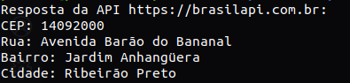

# Desafio 2 - Multithreading (Pós Graduação GoExpert)

### DESCRIÇÃO DO DESAFIO

**Objetivo:** Neste desafio você terá que usar o que aprendemos com Multithreading e APIs para buscar o resultado mais rápido entre duas APIs distintas.

As duas requisições serão feitas simultaneamente para as seguintes APIs:

https://brasilapi.com.br/api/cep/v1/{cep}

http://viacep.com.br/ws/" + {cep} + "/json/


**Obs.:** Exemplo de {cep}: 14092000

**Requisitos:**

- Acatar a API que entregar a resposta mais rápida e descartar a resposta mais lenta.

- O resultado da request deverá ser exibido na command line com os dados do endereço, bem como qual API a enviou.

- Limitar o tempo de resposta em 1 segundo. Caso contrário, o erro de timeout deve ser exibido.


### PRÉ-REQUISITOS

#### 1. Instalar o GO no sistema operacional:

É possível encontrar todas as instruções de como baixar e instalar o `GO` nos sistemas operacionais Windows, Mac ou Linux [aqui](https://go.dev/doc/install).

#### 2. Instalar o Git no sistema operacional:

É possível encontrar todas as instruções de como baixar e instalar o `Git` nos sistemas operacionais Windows, Mac ou Linux [aqui](https://www.git-scm.com/downloads).

#### 3. Clonar o repositório:

```
git clone git@github.com:raphapaulino/pos-graduacao-goexpert-desafio-2-multithreading.git
```

### EXECUTANDO O PROJETO

1. Estando na raiz do projeto, via terminal, execute o comando abaixo:

```
go run main.go
```

2. O teste acima irá gerar um resultado semelhante a imagem abaixo:




That's all folks! : )


## Contacts

[LinkedIn](https://www.linkedin.com/in/raphaelalvespaulino/)

[GitHub](https://github.com/raphapaulino/)

[My Portfolio](https://www.raphaelpaulino.com.br/)